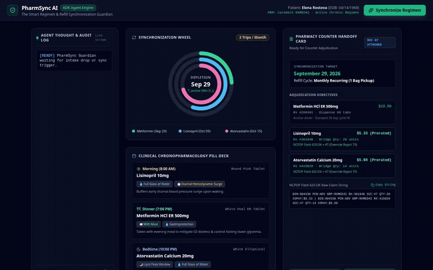

# 🏥 PharmSync AI: The Smart Regimen & Refill Synchronization Guardian

An autonomous clinical agent and mobile guardian built with the **Google Agent Development Kit (ADK)** and **Gemini 2.5 Flash on Vertex AI**. 

PharmSync AI resolves fragmented prescription refills for patients managing chronic conditions (like hypertension and type 2 diabetes). It eliminates zero-day therapy gaps, aligns all medications to a single monthly pickup date, and computes pharmacy claim overrides (**NCPDP Field 420-DK SCC 47**) with statutory prorated copays to prevent insurance claim rejections (**Reject 79: "Refill Too Soon"**).

---

## 🎬 Demo Walkthrough



*The demonstration shows the live 3-panel dynamic canvas running regimen synchronization with animated spring arcs, the mobile Android simulator tracking doses, and the ADK Agent Dev UI executing multi-tool queries with database adjudication lookups.*

---

## 🧠 What the Agent Actually Does

PharmSync AI operates as a clinical decision engine powered by Google ADK with two registered tools:

1. **`run_pharmsync_optimization`**:
   - **Chronopharmacological Timing Engine**: Evaluates circadian pharmacokinetics and food requirements:
     - Morning (8:00 AM): ACE inhibitors (Lisinopril) timed to buffer morning diurnal hemodynamic surges.
     - Meals (Breakfast & Dinner): Extended-release biguanides (Metformin ER) paired with food for gastroprotection and overnight glycemic control.
     - Bedtime (10:00 PM): Statins (Atorvastatin) aligned with peak nocturnal hepatic cholesterol synthesis.
   - **Resilient Zero-Day Gap Prevention**: Calculates remaining days of supply ($D_i$) for each medication and determines the earliest depletion date ($T_{\text{empty}} = \min_i(D_i)$). If an arbitrary date is chosen that exceeds $T_{\text{empty}}$, the agent flags a gap warning and clamps the Anchor Date to $T_{\text{empty}}$ (September 29) to prevent therapy disruption.
   - **NCPDP Reject 79 & SCC 47 Alignment Overrides**: Calculates surplus days ($\Delta D_i = D_i - T_{\text{anchor}}$), determines exact bridge quantities ($Q_{\text{bridge}} = (30 - \Delta D_i) \times \text{Daily Freq}$), and computes statutory prorated copays.
   - **Controlled Substance Lockout**: Excludes DEA Schedule II–IV medications from automated Med-Sync short-fill overrides by regulatory rule.

2. **`get_ncpdp_adjudication_string`**:
   - Database lookup tool returning the standardized NCPDP claim string (`BIN:004336 PCN:ADV GRP:RXMED42 RX:301948 SCC:47 QTY:20 COPAY:$5.33`) formatted for one-click entry into pharmacy management systems (PMS).

---

## ☁️ Google Cloud Services & Tools Wired Up

Based on `app/agent.py`, `app/app_utils/services.py`, and `agents-cli-manifest.yaml`, the following services and libraries are configured:

- **Google ADK (`google-adk`)**: Core agent framework organizing the root agent, application definition, and tool bindings.
- **Vertex AI Gemini (`gemini-2.5-flash`)**: Cloud foundation model powering agent reasoning and tool orchestration via Google Application Default Credentials (ADC).
- **Session Services**:
  - `InMemorySessionService`: Used during local execution and dev playground sessions.
  - `VertexAiSessionService`: Wired up in `app_utils/services.py` for cloud runtime sessions when `GOOGLE_CLOUD_AGENT_ENGINE_ID` is present.
- **Artifact Services**:
  - `InMemoryArtifactService`: Local artifact storage.
  - `GcsArtifactService`: Wired up in `app_utils/services.py` for Google Cloud Storage artifact handling when `ARTIFACT_SERVICE_URI` points to `gs://`.
- **A2A (Agent-to-Agent) Protocol**: Enabled via `is_a2a: true` in `agents-cli-manifest.yaml` and `app/app_utils/a2a.py`.

*Note: Vertex AI Memory Bank, Firestore databases, and server-side image generation tools were part of the expanded roadmap and are **planned, not yet implemented**.*

---

## 📱 User Interfaces Included

- **Dynamic 3-Panel Clinical Canvas (`ui/` / FastAPI)**:
  - **Left Panel**: Real-time agent thought & audit stream (`[OCR]`, `[CHRONO]`, `[GAP ALERT]`, `[BILLING]`).
  - **Center Panel**: SVG-based **Synchronization Wheel** with spring transitions that consolidate 3 fragmented refill cycles into September 29, plus the **Daily Pill Deck**.
  - **Right Panel**: **Pharmacy Counter Handoff Card** with copyable NCPDP billing strings.
- **Mobile Simulator (`/mobile`)**:
  - Android-styled preview showing pill bottle camera scan simulation, interactive dose completion checkmarks, and a collapsible agent thought drawer.
- **Android Native Codebase (`pharmsync-mobile/`)**:
  - Complete native Android project written in **Kotlin + Jetpack Compose + Material 3 + StateFlow**.

---

## 🚀 Setup & Local Execution Instructions

### Prerequisites
- Python 3.11+
- Google Cloud Project with Vertex AI API enabled and Application Default Credentials configured:
  ```bash
  gcloud auth application-default login
  gcloud config set project <YOUR_PROJECT_ID>
  ```

### 1. Install Dependencies
```bash
cd pharmsync-agent
pip install -r requirements.txt
```

### 2. Run the Interactive 3-Panel Canvas & Mobile Simulator
Start the FastAPI server:
```bash
python3 ui/server.py
```
Open your browser and navigate to the local server port (defaults to port `8000`) for the full 3-panel canvas, or append `/mobile` to test the mobile simulator.

### 3. Run the ADK Agent Playground
Run the local ADK developer UI to chat with the agent and inspect tool calls:
```bash
agents-cli playground --port 8080
```

### 4. Non-Interactive CLI Query
Run a single query directly from the terminal:
```bash
agents-cli run --app-name app "Elena Rostova takes Metformin, Lisinopril, and Atorvastatin. Run PharmSync optimization to synchronize her regimen."
```
